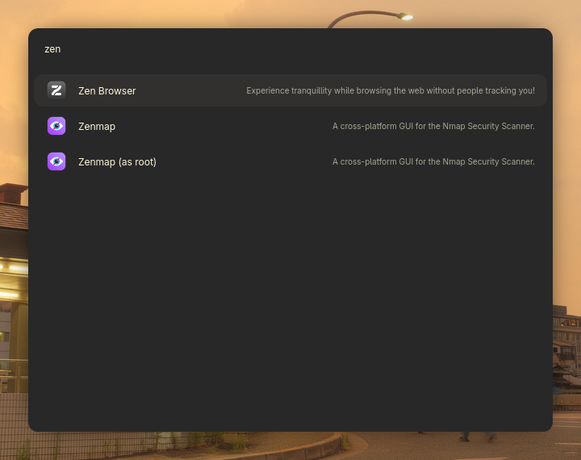
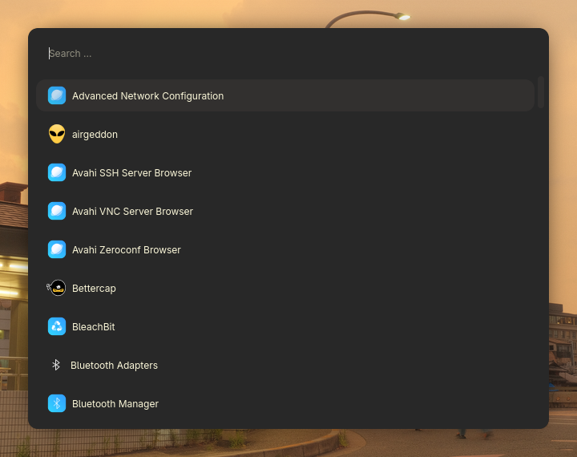

<div align="center">

# `HotSpot`

### A native launcher for your desktop written in C++ QT




## Install:

```bash

git clone https://github.com/Nighty3098/HotSpot
cd HotSpot
mkdir build && cd build
cmake .. && make

```

</div>
